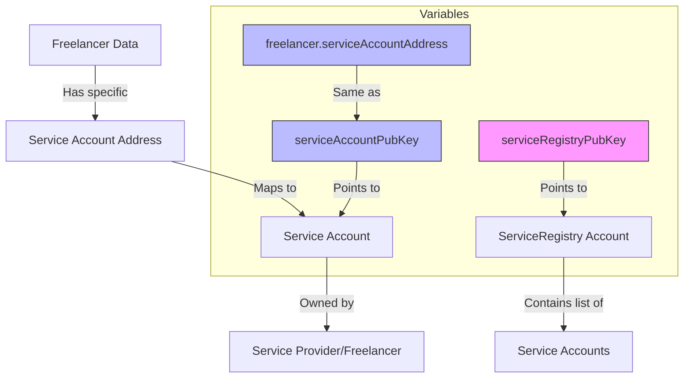

```mermaid
graph TD
    A[ServiceRegistry Account] -->|Contains list of| B[Service Accounts]
    C[Freelancer Data] -->|Has specific| D[Service Account Address]
    D -->|Maps to| E[Service Account]
    E -->|Owned by| F[Service Provider/Freelancer]

    subgraph Variables
        G[serviceRegistryPubKey] -->|Points to| A
        H[serviceAccountPubKey] -->|Points to| E
        I[freelancer.serviceAccountAddress] -->|Same as| H
    end

    style G fill:#f9f,stroke:#333
    style H fill:#bbf,stroke:#333
    style I fill:#bbf,stroke:#333
```
