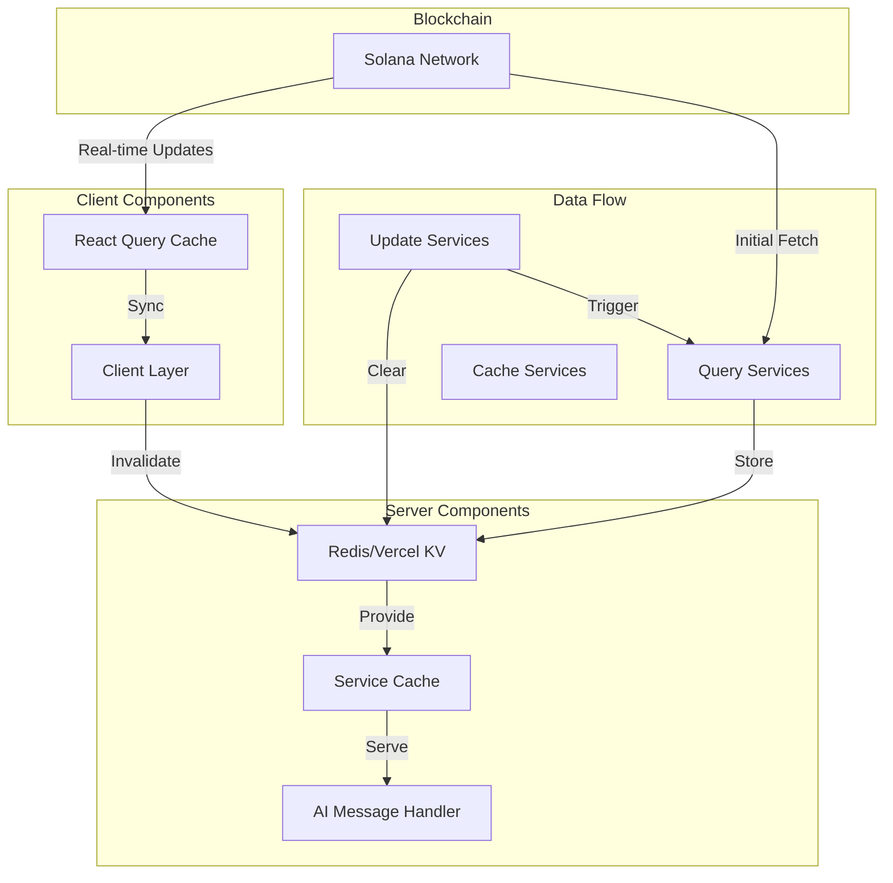

Let me analyze the current implementation and suggest improvements for querying services in the AI message flow.

Currently, the service querying in `actions.tsx` has several issues:

1. **Duplicate Logic**: The service fetching logic is duplicated between client and server components

```41:64:web/app/actions.tsx
// TODO: refactor to use useServiceRegistry hook and getAllServicesForAI function
async function fetchServiceRegistry(endpoint: string) {
  const connection = new Connection(endpoint);
  const provider = new AnchorProvider(connection, {} as AnchorWallet, {
    commitment: 'confirmed',
  });
  const program = getGigenticProgram(provider);

  console.log('========== Fetch service registry');
  const serviceRegistry = await program.account.serviceRegistry.fetch(
    await fetchServiceRegistryPubkey(),
  );

  for (const serviceAddress of serviceRegistry.serviceAccountAddresses) {
    const paymentAddress = serviceAddress.toString();
    console.log('Service Account Address:', paymentAddress);

    const serviceAccount = await program.account.service.fetch(serviceAddress);

    service_registry += `\n${serviceAccount.description} | paymentWalletAddress: ${paymentAddress}`;
  }

  return service_registry;
}
```

2. **Inefficient Querying**: Each message to the AI triggers a new blockchain query for all services

```76:78:web/app/actions.tsx

  try {
    // provide the service registry as context to the LLM
```

Here's a proposed improved architecture with a mermaid diagram:



Here's how we can improve this:

1. **Implement Server-Side Caching**:

```typescript
// lib/cache/service-cache.ts
import { kv } from '@vercel/kv';
import { ServiceAccount } from '@gigentic-frontend/types';

const CACHE_KEY = 'service-registry';
const CACHE_TTL = 60 * 5; // 5 minutes

export async function getCachedServices() {
  const cached = await kv.get(CACHE_KEY);
  if (cached) return cached as ServiceAccount[];

  const services = await fetchAllServices();
  await kv.set(CACHE_KEY, services, { ex: CACHE_TTL });

  return services;
}

export async function invalidateServiceCache() {
  await kv.del(CACHE_KEY);
}
```

2. **Modify AI Message Handler**:

```typescript
// app/actions.tsx
export async function sendMessage(message: string, endpoint: string) {
  const services = await getCachedServices();
  const serviceContext = formatServicesForAI(services);

  const history = getMutableAIState<typeof AI>();

  // Use cached services instead of fetching
  const reply = await streamUI({
    model: openai('gpt-4'),
    messages: [
      {
        role: 'system',
        content: serviceContext,
      },
      ...history.get(),
    ],
    // ... rest of the configuration
  });
}
```

3. **Add Cache Invalidation**:

```typescript
// hooks/blockchain/use-gigentic-program.ts
export function useGigenticProgram() {
  const accounts = useQuery({
    queryKey: ['services', { cluster }],
    queryFn: async () => {
      const services = await program.account.service.all();
      // Invalidate server cache when client data changes
      await invalidateServiceCache();
      return services;
    },
  });
}
```

Key benefits of this approach:

1. **Reduced Blockchain Queries**:

- Caches service data on the server
- Reuses cached data for AI interactions
- Only queries blockchain when cache expires

2. **Better Performance**:

- Faster AI responses
- Lower RPC costs
- Reduced network traffic

3. **Consistency**:

- Server and client stay in sync
- Cache invalidation on updates
- Predictable data freshness

4. **Error Handling**:

```typescript
// lib/cache/service-cache.ts
export async function getCachedServices() {
  try {
    const cached = await kv.get(CACHE_KEY);
    if (cached) return cached as ServiceAccount[];

    const services = await fetchAllServices();
    await kv.set(CACHE_KEY, services, { ex: CACHE_TTL });

    return services;
  } catch (error) {
    console.error('Service cache error:', error);
    // Fallback to direct blockchain query
    return fetchAllServices();
  }
}
```

This architecture provides a more efficient and scalable approach to handling service queries in the AI message flow while maintaining data consistency between client and server components.
