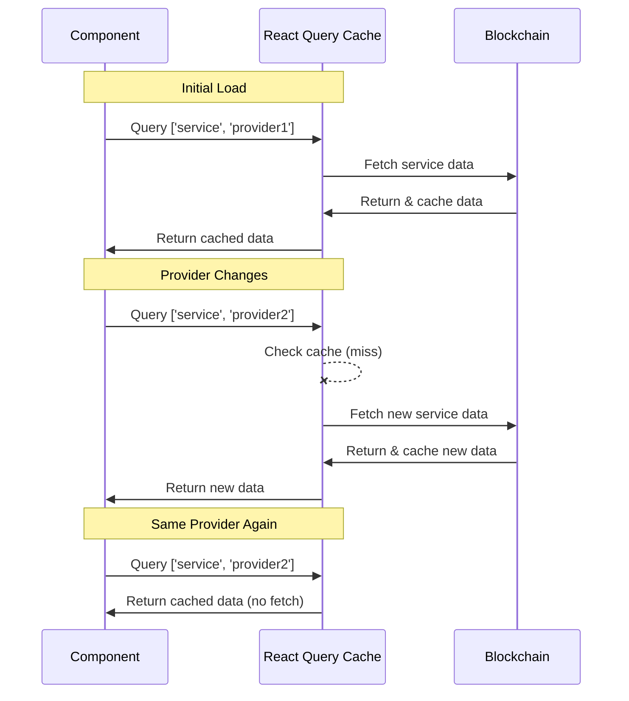

## Q: How does this tanstack useQuery work?

_If i use the code you suggest then I am not using the code that is implemented in use-service-account.ts. Can you pls explain this?_

Certainly! Let's break down how `useQuery` from TanStack Query works and how it relates to your existing `useServiceAccount` implementation.

### How `useQuery` Works

`useQuery` is a hook provided by TanStack Query (formerly React Query) that allows you to fetch, cache, and update data in your React applications. Here's a basic overview of its functionality:

1. **Data Fetching**: `useQuery` takes a `queryKey` and a `queryFn`. The `queryKey` is a unique identifier for the query, and the `queryFn` is the function that fetches the data.

2. **Caching**: The data fetched by `useQuery` is cached using the `queryKey`. This means that if the same query is requested again, it can return the cached data instead of refetching it.

3. **Stale Time**: You can specify a `staleTime`, which determines how long the data is considered fresh. After this time, the data is considered stale, and a new fetch will be triggered on the next request.

4. **Automatic Refetching**: `useQuery` can automatically refetch data when certain conditions change, such as when the component mounts or when the `queryKey` changes.

5. **Error Handling**: It provides built-in error handling and loading states, which can be accessed through the returned object.

### Integration with `useServiceAccount`

The `useServiceAccount` hook likely uses `useQuery` internally to fetch and cache service account data. Here's how you can integrate it with the refactored `useEscrowData`:

1. **Reuse Query Keys**: Ensure that the `queryKey` used in `useEscrowData` matches the one in `useServiceAccount`. This way, the cache is shared between the two hooks.

2. **Avoid Duplicate Fetches**: By using the same `queryKey`, you avoid fetching the same data multiple times. If `useServiceAccount` has already fetched and cached the data, `useEscrowData` can use the cached data.

3. **Parallel Fetching**: If `useServiceAccount` is designed to fetch data for a single account, you can use it in a loop or with `useQueries` to fetch multiple accounts in parallel.

### Example Integration

Here's how you might integrate `useServiceAccount` into `useEscrowData`:

```typescript
import { useQuery, useQueries } from '@tanstack/react-query';
import { useWallet } from '@solana/wallet-adapter-react';
import { useGigenticProgram } from './use-gigentic-program';
import { useCluster } from '@/cluster/cluster-data-access';
import { useServiceAccount } from './use-service-account'; // Import the hook
import { EscrowAccount } from '@/lib/types/escrow';

// ... existing interfaces and helper functions ...

export function useEscrowData() {
  const { publicKey } = useWallet();
  const { program } = useGigenticProgram();
  const { cluster } = useCluster();

  // First query to get escrows
  const escrowQuery = useQuery({
    queryKey: ['escrow-accounts', { cluster, publicKey: publicKey?.toString() }],
    queryFn: async () => {
      if (!publicKey) return [];
      const allEscrows = await program.account.escrow.all();
      return allEscrows.filter((escrow) => escrow.account.customer.toString() === publicKey.toString());
    },
    enabled: !!publicKey,
  });

  // Use the existing useServiceAccount hook
  const serviceQueries = (escrowQuery.data || []).map((escrow) => useServiceAccount(escrow.account.serviceProvider));

  // Combine the data
  return useQuery({
    queryKey: ['escrow-data', { cluster, publicKey: publicKey?.toString() }],
    queryFn: () => {
      if (!escrowQuery.data || serviceQueries.some((query) => query.isLoading)) {
        return { escrows: [], titles: {} };
      }

      const titles: Record<string, string> = {};
      escrowQuery.data.forEach((escrow, index) => {
        const serviceQuery = serviceQueries[index];
        if (serviceQuery.data) {
          titles[escrow.publicKey.toString()] = extractServiceTitle(serviceQuery.data.description);
        } else {
          titles[escrow.publicKey.toString()] = 'Unnamed Service';
        }
      });

      return {
        escrows: escrowQuery.data,
        titles,
      };
    },
    enabled: !!publicKey && !!escrowQuery.data && serviceQueries.every((q) => !q.isLoading),
  });
}
```

### Key Points

- **Reuse of `useServiceAccount`**: By using `useServiceAccount` within `useEscrowData`, you leverage its caching and fetching logic, ensuring consistency and efficiency.
- **Shared Cache**: Using the same `queryKey` ensures that both hooks share the same cache, preventing redundant network requests.
- **Parallel Fetching**: `useQueries` or mapping over `useServiceAccount` allows fetching multiple service accounts in parallel, improving performance.

This approach ensures that your application efficiently uses cached data and minimizes network requests, while still leveraging the existing logic in `useServiceAccount`.

## If the escrow.account.serviceProvider changes in the "service" useQuery, than it will refetch the data anyway, right?

Yes, exactly! When `escrow.account.serviceProvider` changes, React Query will automatically trigger a refetch because it's part of the `queryKey`. Let's break down how this works:

```typescript:web/lib/hooks/blockchain/use-service-account.ts
export function useServiceAccount(account: PublicKey) {
  const { program } = useGigenticProgram();

  return useQuery({
    queryKey: ['service', account.toString()], // 👈 Query key includes the account
    queryFn: () => program.account.service.fetch(account),
  });
}
```

When the `serviceProvider` changes:

1. The `queryKey` changes (`['service', newServiceProvider.toString()]`)
2. React Query detects this change
3. It triggers a new fetch for the updated service provider

Here's a visualization of this behavior:



This automatic refetching is good because:

- It ensures data consistency when the provider changes
- Still leverages caching for unchanged providers
- Handles updates to service account data automatically

If you want to optimize this further, you could:

1. Add `staleTime` to reduce refetches
2. Use `placeholderData` for smoother transitions
3. Implement optimistic updates for known changes

## Then this is not so optimal if the Provider we look up changes a lot.

You're right. If the `serviceProvider` changes frequently, it can lead to excessive refetching, which might not be optimal. Here are some strategies to mitigate this:

### Strategies to Optimize Frequent Changes

1. **Increase `staleTime`**:

   - By increasing the `staleTime`, you can reduce the frequency of refetches. This means the data will be considered fresh for a longer period, even if the `serviceProvider` changes.

   ```typescript
   return useQuery({
     queryKey: ['service', account.toString()],
     queryFn: () => program.account.service.fetch(account),
     staleTime: 5 * 60 * 1000, // 5 minutes
   });
   ```

2. **Use `placeholderData`**:

   - Provide initial data while the new data is being fetched. This can help maintain a smooth user experience.

   ```typescript
   return useQuery({
     queryKey: ['service', account.toString()],
     queryFn: () => program.account.service.fetch(account),
     placeholderData: { description: 'Loading...' /* other fields */ },
   });
   ```

3. **Batch Fetching**:

   - If you know multiple providers will change, consider fetching them in a batch to reduce the number of network requests.

   ```typescript
   const serviceAccounts = await program.account.service.fetchMultiple(providerKeys);
   ```

4. **Debounce or Throttle Updates**:

   - If the changes are triggered by user input or other events, consider debouncing or throttling the updates to reduce the frequency of changes.

   ```typescript
   const debouncedFetch = useCallback(
     debounce((provider) => {
       // Fetch logic here
     }, 300), // 300ms debounce
     [],
   );
   ```

5. **Optimistic Updates**:

   - If you can predict the changes, update the UI optimistically and refetch in the background.

   ```typescript
   const { mutate } = useMutation(updateServiceProvider, {
     onMutate: (newProvider) => {
       // Optimistically update the cache
     },
     onSuccess: () => {
       // Refetch or invalidate queries
     },
   });
   ```

### Considerations

- **Trade-offs**: Increasing `staleTime` reduces refetches but may lead to stale data. Choose a balance that fits your application's needs.
- **User Experience**: Use `placeholderData` and optimistic updates to keep the UI responsive and smooth.
- **Network Efficiency**: Batch fetching and debouncing can significantly reduce network load.

These strategies can help you manage frequent changes more efficiently, improving both performance and user experience. Let me know if you need further details on implementing any of these strategies!

## What is this useMutation?

`useMutation` is a hook from TanStack Query (React Query) specifically designed for handling data mutations (create, update, delete operations) as opposed to data fetching. It provides a structured way to handle side effects and cache updates.

Here's a practical example using your escrow context:

```typescript
import { useMutation, useQueryClient } from '@tanstack/react-query';
import { PublicKey } from '@solana/web3.js';

export function useEscrowTransactions() {
  const queryClient = useQueryClient(); // Access to query cache
  const { program } = useGigenticProgram();

  // Define mutation for paying into escrow
  const payIntoEscrow = useMutation({
    // Mutation function
    mutationFn: async ({ serviceProvider, amount }: { serviceProvider: PublicKey; amount: number }) => {
      // Your transaction logic here
      const tx = await program.methods
        .payService(amount)
        .accounts({
          serviceProvider,
          // ... other accounts
        })
        .rpc();
      return tx;
    },

    // Runs before mutation
    onMutate: async (variables) => {
      // Optionally cancel outgoing refetches
      await queryClient.cancelQueries({ queryKey: ['escrow-data'] });

      // Snapshot previous value
      const previousEscrows = queryClient.getQueryData(['escrow-data']);

      // Optimistically update cache
      queryClient.setQueryData(['escrow-data'], (old: any) => ({
        ...old,
        // Add new escrow optimistically
      }));

      return { previousEscrows };
    },

    // On success
    onSuccess: (data, variables, context) => {
      // Invalidate and refetch
      queryClient.invalidateQueries({ queryKey: ['escrow-data'] });
      toast.success('Payment successful!');
    },

    // On error
    onError: (error, variables, context) => {
      // Revert optimistic update
      queryClient.setQueryData(['escrow-data'], context?.previousEscrows);
      toast.error('Payment failed');
    },
  });

  return {
    payIntoEscrow: payIntoEscrow.mutate,
    isPaying: payIntoEscrow.isPending,
    error: payIntoEscrow.error,
  };
}
```

Usage in a component:

```typescript:web/components/payment/PaymentButton.tsx
export function PaymentButton({ serviceProvider, amount }: Props) {
  const { payIntoEscrow, isPaying, error } = useEscrowTransactions();

  return (
    <Button
      onClick={() => payIntoEscrow({ serviceProvider, amount })}
      disabled={isPaying}
    >
      {isPaying ? 'Processing...' : 'Pay'}
    </Button>
  );
}
```

Key features of `useMutation`:

1. **State Management**:

```typescript
const {
  mutate,      // Function to trigger the mutation
  isPending,   // Boolean indicating if mutation is in progress
  isError,     // Boolean indicating if mutation resulted in an error
  error,       // Error object if present
  isSuccess,   // Boolean indicating if mutation was successful
  data,        // Data returned from the mutation
} = useMutation({ ... });
```

2. **Lifecycle Methods**:

```typescript
useMutation({
  mutationFn: async (variables) => {
    // Main mutation logic
  },
  onMutate: (variables) => {
    // Called before mutation
    // Good place for optimistic updates
  },
  onError: (error, variables, context) => {
    // Called on error
    // Good place for error handling and rollbacks
  },
  onSuccess: (data, variables, context) => {
    // Called on success
    // Good place for side effects and cache updates
  },
  onSettled: (data, error, variables, context) => {
    // Called on either success or error
    // Good place for cleanup
  },
});
```

3. **Cache Integration**:

```typescript
const queryClient = useQueryClient();

useMutation({
  onSuccess: () => {
    // Invalidate and refetch
    queryClient.invalidateQueries({ queryKey: ['escrow-data'] });

    // Or update cache directly
    queryClient.setQueryData(['escrow-data'], (old) => ({
      ...old,
      // update data
    }));
  },
});
```

`useMutation` is particularly useful for:

- Handling loading, error, and success states
- Managing optimistic updates
- Coordinating cache updates
- Handling side effects
- Providing rollback mechanisms

Would you like me to elaborate on any of these aspects or show more specific examples for your escrow system?
