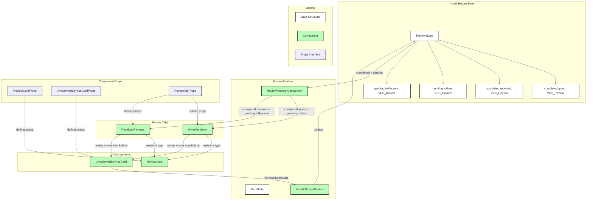

```mermaid
graph TD
    %% Data Structure Subgraph
    subgraph "Hook Return Type"
        RD[ReviewsData]:::data
        RDG[completed.given: VEC_Review]:::data
        RDR[completed.received: VEC_Review]:::data
        PDG[pending.toGive: VEC_Review]:::data
        PDR[pending.toReceive: VEC_Review]:::data

        RD --> RDG
        RD --> RDR
        RD --> PDG
        RD --> PDR
    end

    %% Main Component
    subgraph "ReviewFeature"
        RF[ReviewFeature Component]:::component
        TS[TabsState]:::data
        HSR[handleSubmitReview]:::component
    end

    %% Tab Components
    subgraph "Review Tabs"
        GR[GivenReviews]:::component
        RR[ReceivedReviews]:::component
    end

    %% UI Components
    subgraph "UI Components"
        RC[ReviewCard]:::component
        USC[UnreviewedServiceCard]:::component
    end

    %% Props Interfaces
    subgraph "Component Props"
        RCP[ReviewCardProps]:::props
        USCP[UnreviewedServiceCardProps]:::props
        RTP[ReviewTabProps]:::props
    end

    %% Data Flow
    RD -->|"completed + pending"| RF
    RF -->|"completed.given + pending.toGive"| GR
    RF -->|"completed.received + pending.toReceive"| RR

    GR -->|"review + type"| RC
    RR -->|"review + type"| RC
    GR -->|"review + type + onSubmit"| USC
    RR -->|"review + type + onSubmit"| USC

    %% Props Flow
    RTP -->|"defines props"| GR
    RTP -->|"defines props"| RR
    RCP -->|"defines props"| RC
    USCP -->|"defines props"| USC

    %% Submit Flow
    USC -->|"ReviewSubmitData"| HSR
    HSR -->|"Update"| RD

    %% Class Definitions
    classDef data fill:#fff,stroke:#333,stroke-width:2px
    classDef component fill:#bfb,stroke:#333,stroke-width:2px
    classDef props fill:#eef,stroke:#333,stroke-width:2px

    %% Legend
    subgraph "Legend"
        L1[Data Structure]:::data
        L2[Component]:::component
        L3[Props Interface]:::props
    end
```
