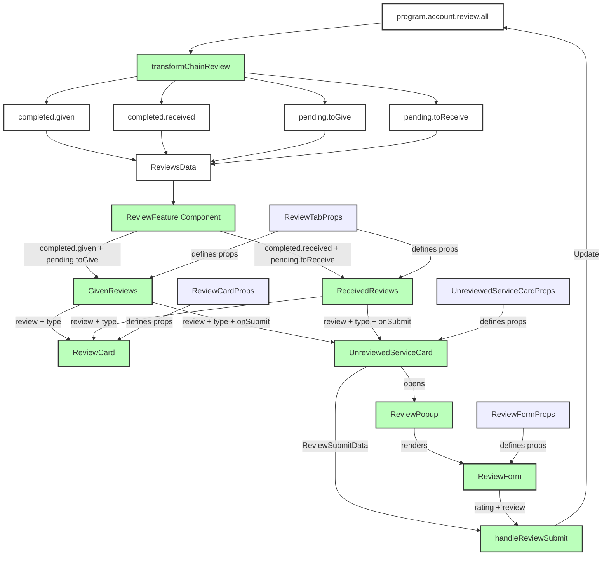

```mermaid
graph TD
    %% Data Structure Subgraph
    %% subgraph "Hook Return Type"

    %% end

    %% Chain Data
    %% subgraph "Blockchain Layer"
        CR[program.account.review.all]:::data
        TR[transformChainReview]:::component

        RD[ReviewsData]:::data
        RDG[completed.given]:::data
        RDR[completed.received]:::data
        PDG[pending.toGive]:::data
        PDR[pending.toReceive]:::data

        CR --> TR
        TR --> RDG
        TR --> RDR
        TR --> PDG
        TR --> PDR

        RDG --> RD
        RDR --> RD
        PDG --> RD
        PDR --> RD

    %% end

    %% Main Component
    %% subgraph "ReviewFeature"
        RF[ReviewFeature Component]:::component
        HSR[handleReviewSubmit]:::component
        %% LD[LoadingState]:::component
        %% ED[ErrorState]:::component
    %% end

    %% Tab Components
    %% subgraph "Review Tabs"
        GR[GivenReviews]:::component
        RR[ReceivedReviews]:::component
    %% end

    %% UI Components
    %% subgraph "UI Components"
        RC[ReviewCard]:::component
        USC[UnreviewedServiceCard]:::component
        RP[ReviewPopup]:::component
        RF2[ReviewForm]:::component
    %% end

    %% Props Interfaces
    %% subgraph "Component Props"
        RCP[ReviewCardProps]:::props
        USCP[UnreviewedServiceCardProps]:::props
        RTP[ReviewTabProps]:::props
        RFP[ReviewFormProps]:::props
    %% end

    %% Data Flow
    RD --> RF
    RF -->|"completed.given + pending.toGive"| GR
    RF -->|"completed.received + pending.toReceive"| RR

    GR -->|"review + type"| RC
    RR -->|"review + type"| RC
    GR -->|"review + type + onSubmit"| USC
    RR -->|"review + type + onSubmit"| USC
    USC -->|"opens"| RP
    RP -->|"renders"| RF2

    %% Props Flow
    RTP -->|"defines props"| GR
    RTP -->|"defines props"| RR
    RCP -->|"defines props"| RC
    USCP -->|"defines props"| USC
    RFP -->|"defines props"| RF2

    %% Submit Flow
    USC -->|"ReviewSubmitData"| HSR
    RF2 -->|"rating + review"| HSR
    HSR -->|"Update"| CR

    %% Class Definitions
    classDef data fill:#fff,stroke:#333,stroke-width:2px
    classDef component fill:#bfb,stroke:#333,stroke-width:2px
    classDef props fill:#eef,stroke:#333,stroke-width:2px

    %% %% Legend
    %% subgraph "Legend"
    %%     L1[Data Structure]:::data
    %%     L2[Component]:::component
    %%     L3[Props Interface]:::props
    %% end
```
