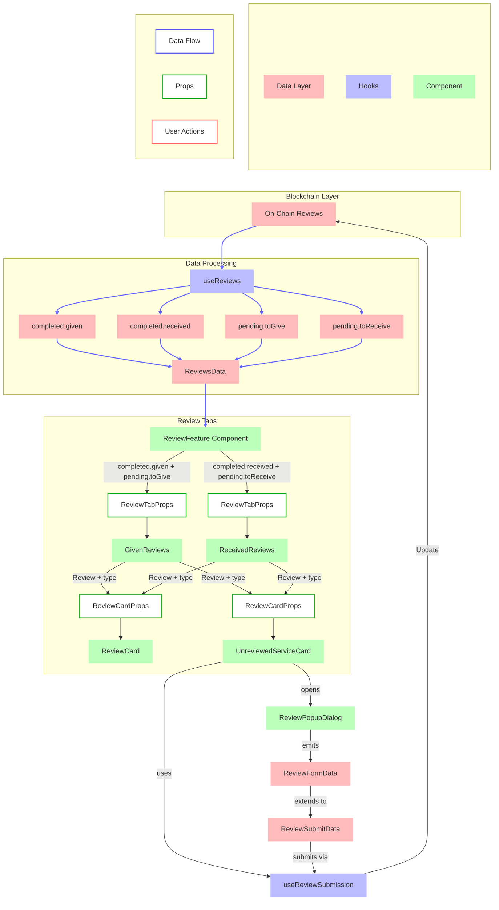

```mermaid
flowchart TD
    %% Data Layer
    subgraph "Blockchain Layer"
      CR[program.account.review.all]:::dataLayer
    end

    subgraph "Data Processing"
      TR[useReviews]:::hook
      RD[ReviewsData]:::dataLayer
      RDG[completed.given]:::dataLayer
      RDR[completed.received]:::dataLayer
      PDG[pending.toGive]:::dataLayer
      PDR[pending.toReceive]:::dataLayer
    end

      CR --> TR
      TR --> RDG
      TR --> RDR
      TR --> PDG
      TR --> PDR

      RDG --> RD
      RDR --> RD
      PDG --> RD
      PDR --> RD

    linkStyle 0,1,2,3,4,5,6,7,8 stroke:#66f,stroke-width:2px

    %% Main Component
    subgraph "Review Tabs"
      RD --> RF
      linkStyle 9 stroke:#66f,stroke-width:2px
      RF[ReviewFeature Component]:::component

      RF -->|"completed.given + pending.toGive"| RTP1
      RF -->|"completed.received + pending.toReceive"| RTP2
      RTP1[ReviewTabProps]:::prop
      RTP2[ReviewTabProps]:::prop
      RTP1 --> GR
      RTP2 --> RR
      GR[GivenReviews]:::component
      RR[ReceivedReviews]:::component
      GR -->|"Review + type"| RCP
      RR -->|"Review + type"| RCP
      RCP[ReviewCardProps]:::prop
      RCP --> RC
      RC[ReviewCard]:::component
      GR -->|"Review + type"| USCP
      RR -->|"Review + type"| USCP
      USCP[ReviewCardProps]:::prop
      USC[UnreviewedServiceCard]:::component
      USCP --> USC
    end

    %% Components
    RPD[ReviewPopupDialog]:::component

    %% Hooks and Data
    URS[useReviewSubmission]:::hook
    RFD[ReviewFormData]:::dataLayer
    RSD[ReviewSubmitData]:::dataLayer

    %% Flow
    USC -->|"opens"| RPD
    USC -->|"uses"| URS
    RPD -->|"emits"| RFD
    RFD -->|"extends to"| RSD
    RSD -->|"submits via"| URS
    URS -->|"Update"| CR[On-Chain Reviews]:::dataLayer


    %% RP[ReviewPopup]:::component
    %% RFP[ReviewFormProps]:::prop
    %% RFP --> RF2
    %% RF2[ReviewForm]:::component
    %% RSD[ReviewSubmitData]:::prop

    %% HSR[handleReviewSubmit]:::component


    %% %% Submit Flow
    %% USC -->|"ReviewSubmitData"| HSR
    %% RSD --> HSR
    %% RF2 -->|"rating + review"| HSR
    %% HSR -->|"Update"| CR

    L1 ~~~ CR

    %% Style different types of arrows

    %% linkStyle 3,4,5,6 stroke:#2a2,stroke-width:2px
    %% linkStyle 7,8 stroke:#f66,stroke-width:2px

    %% Class Definitions
    classDef dataLayer fill:#fbb,stroke-width:0px
    classDef hook fill:#bbf,stroke-width:0px
    classDef dataFlow fill:#fff,stroke:#66f,stroke-width:2px
    classDef component fill:#bfb,stroke-width:0px
    classDef prop fill:#fff,stroke:#2a2,stroke-width:2px
    classDef action fill:#fff,stroke:#f66,stroke-width:2px

    %% Legend Top
    subgraph " "
        L1[Data Layer]:::dataLayer
        L2[Hooks]:::hook
        L3[Component]:::component
    end

    %% Legend Bottom
    subgraph " "
        L4["Data Flow"]:::dataFlow
        L5["Props"]:::prop
        L6["User Actions"]:::action
    end
```
