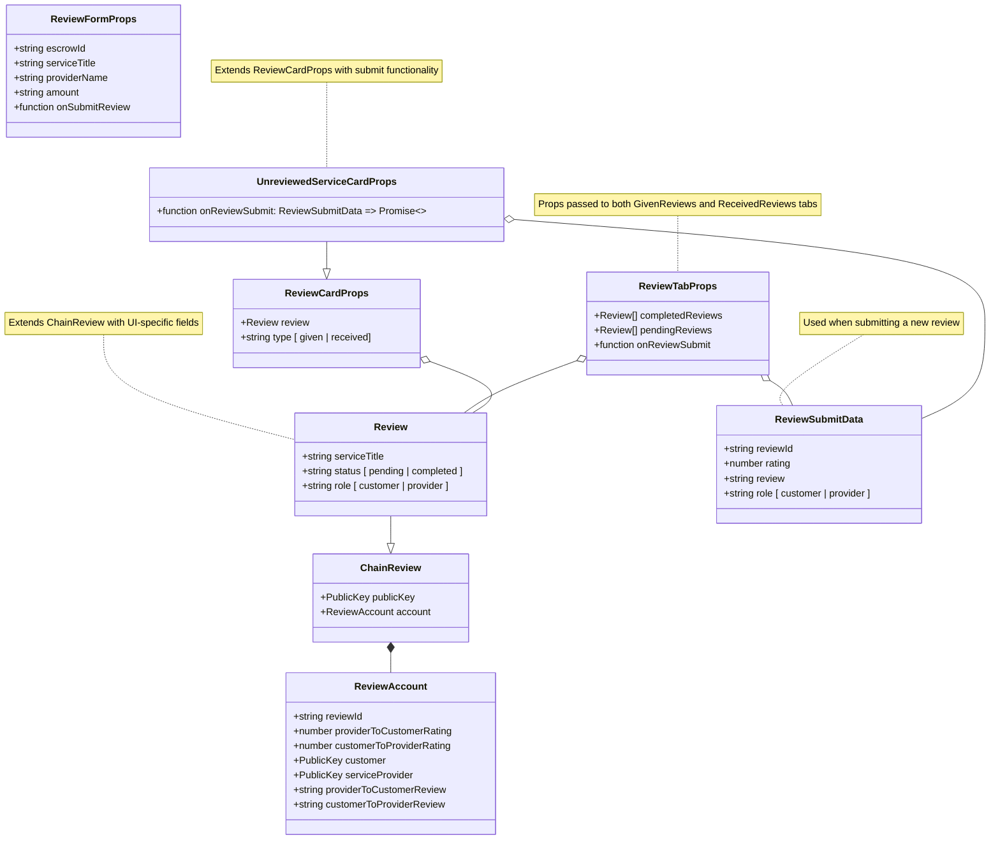

```mermaid
classDiagram

    class ReviewFormProps {
        +string escrowId
        +string serviceTitle
        +string providerName
        +string amount
        +function onSubmitReview
    }

    class ReviewTabProps {
        +Review[] completedReviews
        +Review[] pendingReviews
        +function onReviewSubmit
    }

    class Review {
        +string serviceTitle
        +string status [ pending | completed ]
        +string role [ customer | provider ]
    }

    class ChainReview {
        +PublicKey publicKey
        +ReviewAccount account
    }

    class ReviewAccount {
        +string reviewId
        +number providerToCustomerRating
        +number customerToProviderRating
        +PublicKey customer
        +PublicKey serviceProvider
        +string providerToCustomerReview
        +string customerToProviderReview
    }

    class ReviewSubmitData {
        +string reviewId
        +number rating
        +string review
        +string role [ customer | provider ]
    }

    class ReviewCardProps {
        +Review review
        +string type [ given | received]
    }

    class UnreviewedServiceCardProps {
        +function onReviewSubmit: ReviewSubmitData => Promise<>
    }

    ChainReview *-- ReviewAccount
    Review --|> ChainReview
    UnreviewedServiceCardProps --|> ReviewCardProps

    ReviewTabProps o-- Review
    ReviewTabProps o-- ReviewSubmitData
    ReviewCardProps o-- Review
    UnreviewedServiceCardProps o-- ReviewSubmitData

    note for Review "Extends ChainReview with UI-specific fields"
    note for ReviewSubmitData "Used when submitting a new review"
    note for ReviewTabProps "Props passed to both GivenReviews and ReceivedReviews tabs"
    note for UnreviewedServiceCardProps "Extends ReviewCardProps with submit functionality"
```
