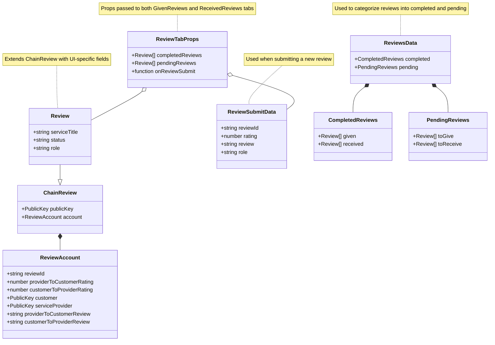

```mermaid
classDiagram
    class ChainReview {
        +PublicKey publicKey
        +ReviewAccount account
    }

    class ReviewAccount {
        +string reviewId
        +number providerToCustomerRating
        +number customerToProviderRating
        +PublicKey customer
        +PublicKey serviceProvider
        +string providerToCustomerReview
        +string customerToProviderReview
    }

    class Review {
        +string serviceTitle
        +string status
        +string role
    }

    class ReviewSubmitData {
        +string reviewId
        +number rating
        +string review
        +string role
    }

    class ReviewsData {
        +CompletedReviews completed
        +PendingReviews pending
    }

    class CompletedReviews {
        +Review[] given
        +Review[] received
    }

    class PendingReviews {
        +Review[] toGive
        +Review[] toReceive
    }

    class ReviewTabProps {
        +Review[] completedReviews
        +Review[] pendingReviews
        +function onReviewSubmit
    }

    ChainReview *-- ReviewAccount
    Review --|> ChainReview
    ReviewsData *-- CompletedReviews
    ReviewsData *-- PendingReviews
    ReviewTabProps o-- Review
    ReviewTabProps o-- ReviewSubmitData

    note for Review "Extends ChainReview with UI-specific fields"
    note for ReviewSubmitData "Used when submitting a new review"
    note for ReviewTabProps "Props passed to both GivenReviews and ReceivedReviews tabs"
    note for ReviewsData "Used to categorize reviews into completed and pending"
```
