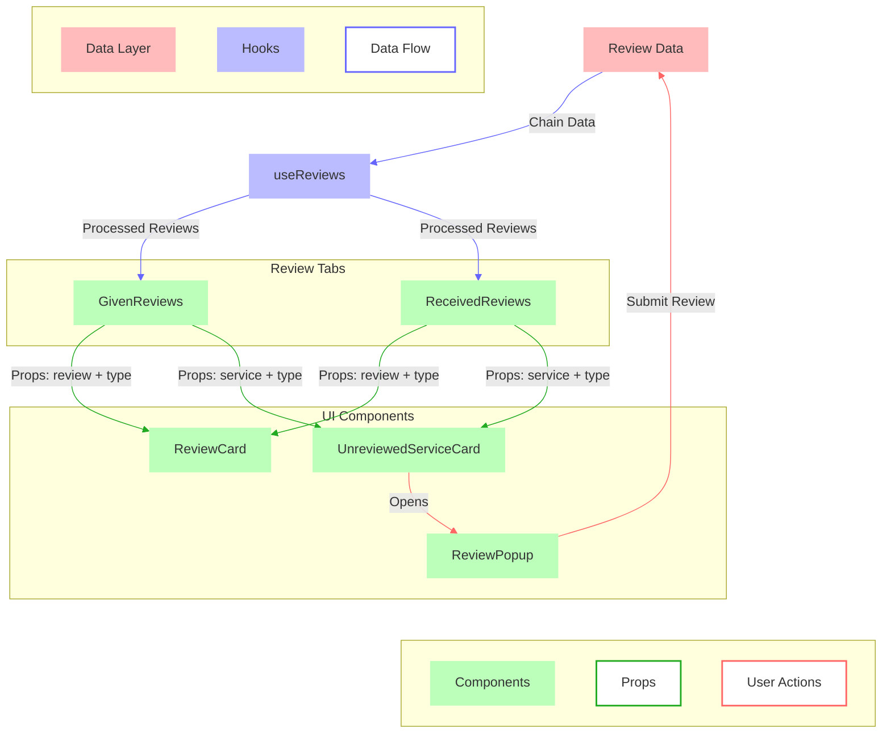

```mermaid
graph TD

        D[Review Data]
        style D fill:#fbb,stroke-width:0px

        UR[useReviews]
        style UR fill:#bbf,stroke-width:0px

    subgraph "Review Tabs"
        GR[GivenReviews]
        RR[ReceivedReviews]
        style GR fill:#bfb,stroke-width:0px
        style RR fill:#bfb,stroke-width:0px
    end

    subgraph "UI Components"
        RC[ReviewCard]
        USC[UnreviewedServiceCard]
        RP[ReviewPopup]
        style RC fill:#bfb,stroke-width:0px
        style USC fill:#bfb,stroke-width:0px
        style RP fill:#bfb,stroke-width:0px
    end


        %% Legend
    subgraph " "
        L1[Data Layer]
        L2[Hooks]
        L4["Data Flow"]
        style L1 fill:#fbb,stroke-width:0px
        style L2 fill:#bbf,stroke-width:0px
        style L3 fill:#bfb,stroke-width:0px
    end

        %% Legend
    subgraph " "
        L3[Components]
        L5["Props"]
        L6["User Actions"]
        style L4 fill:#fff,stroke:#66f,stroke-width:2px
        style L5 fill:#fff,stroke:#2a2,stroke-width:2px
        style L6 fill:#fff,stroke:#f66,stroke-width:2px
    end

    %% Data Flow
    D -->|"Chain Data"| UR
    UR -->|"Processed Reviews"| GR
    UR -->|"Processed Reviews"| RR

    %% Props Flow
    GR -->|"Props: review + type"| RC
    RR -->|"Props: review + type"| RC
    GR -->|"Props: service + type"| USC
    RR -->|"Props: service + type"| USC

    %% User Actions
    USC -->|"Opens"| RP
    RP -->|"Submit Review"| D

    %% Invisible arrow to position legend
    L1 ~~~ UR
    RP ~~~ L3

    %% Style different types of arrows
    linkStyle 0,1,2 stroke:#66f,stroke-width:2px %% Data Flow in blue
    linkStyle 3,4,5,6 stroke:#2a2,stroke-width:2px %% Props Flow in green
    linkStyle 7,8 stroke:#f66,stroke-width:2px %% User Actions in red
```
